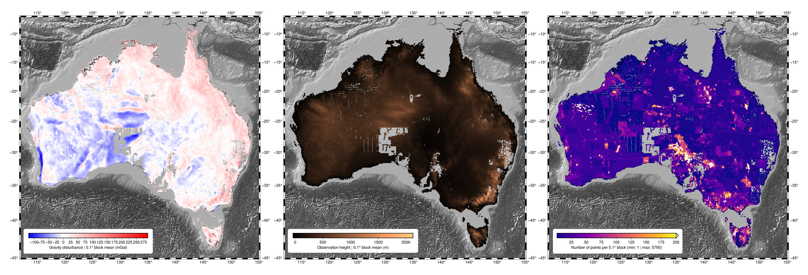

# Gravity ground survey data compilation for Australia

This repository contains code to download, clean, and combine all available
[Geoscience Australia](http://www.ga.gov.au/) ground gravity data.



You can run and explore the code online through [mybinder.org](https://mybinder.org):
[](https://mybinder.org/v2/gh/compgeolab/australia-gravity-data/main?urlpath=lab/tree/notebooks%2Fexplore.ipynb)

| Version | Date | DOI |
|---------|------|-----|
| [v2.0](https://github.com/compgeolab/australia-gravity-data/releases/tag/v2.0) | 2021-08-24 | doi:[10.6084/m9.figshare.13643837](https://doi.org/10.6084/m9.figshare.13643837) |
| [v1.0](https://github.com/compgeolab/australia-gravity-data/releases/tag/v1.0) | 2020-10-28 | doi:[10.6084/m9.figshare.13643837.v1](https://doi.org/10.6084/m9.figshare.13643837.v1) |

## Citing this compilation

If you use this dataset in a publication, please cite both the original
compilation by [Wynne (2018)](https://doi.org/10.26186/5c1987fa17078) and the
figshare archive of this compilation:

> Wynne, P. (2018). NetCDF Ground Gravity Point Surveys Collection (Version 1.0). Commonwealth of Australia (Geoscience Australia). https://doi.org/10.26186/5C1987FA17078
>
> Uieda, L. (2021). Ground gravity data compilation for Australia version 2.0. figshare. https://doi.org/10.6084/m9.figshare.13643837

## Download

The data compilation is available for download as a single netCDF file and also
a plain-text CSV file (which is larger and doesn't include the metadata)
from **figshare**: https://doi.org/10.6084/m9.figshare.13643837

You can download and cache the data directly from your Python code using
[Pooch](https://www.fatiando.org/pooch/latest/):

```python
import xarray as xr
import pooch

# Download and cache the netCDF version (preferred)
fname = pooch.retrieve(
    url="doi:10.6084/m9.figshare.13643837/australia-ground-gravity.nc",
    known_hash="md5:16c94a792003714efee2bdb4f3181d3a",
)

# Load the data with xarray
data = xr.load_dataset(fname)
```

If you need the CSV version, you can use this instead:

```python
import pandas as pd
import pooch

# Download and cache the CSV version (no metadata)
fname = pooch.retrieve(
    url="doi:10.6084/m9.figshare.13643837/australia-ground-gravity.csv",
    known_hash="md5:d47fef200d92c682dc8b63fe31b80364",
)

# Load the data with pandas
data = pd.read_csv(fname)
```

Paste the either of the code blocks above in your Jupyter notebooks or scripts
to let Pooch automatically download the file, store it in a cache folder, check
the download integrity, and return to you the path to the cached file.

The download only happens the first time this code is run.
Afterwards, Pooch finds the data in the cache and only returns the link (so you
can use this code everywhere you need this file).

## About

Based on the compilation by [Wynne (2018)](https://doi.org/10.26186/5c1987fa17078),
which is distributed under a CC-BY 4.0 license (see the source).

**NOTE:** After I did all of this, I discovered
[GeoscienceAustralia/geophys_utils](https://github.com/GeoscienceAustralia/geophys_utils)
which would have allowed me to download the individual surveys using a web API
from Python. This would have saved the work of finding, downloding, and
combining the metadata files.

The metadata records (including the download link) for all of the
original surveys were downloaded manually in batches of 100
(:disappointed:).
These records are available in the `metadata` folder.

## Notebooks

* [`notebooks/1-catalogue.ipynb`](https://nbviewer.jupyter.org/github/compgeolab/australia-gravity-data/blob/main/notebooks/1-catalogue.ipynb):
  combines all these records into a single file
  (`metadata/records.csv`) and includes the proper download URL and file size
  (as returned by the server).
* [`notebooks/2-download.ipynb`](https://nbviewer.jupyter.org/github/compgeolab/australia-gravity-data/blob/main/notebooks/2-download.ipynb):
  uses [Pooch](https://www.fatiando.org/pooch/latest/)
  to download all survey netCDF files to a `data` folder. The 1631 surveys total
  less than 400 MB so it's not a large amount of data. The individual surveys
  will not be included in the repository to avoid making it too big.
* [`notebooks/3-merge.ipynb`](https://nbviewer.jupyter.org/github/compgeolab/australia-gravity-data/blob/main/notebooks/3-merge.ipynb):
  loads all surveys, selects the more relevant data, filter out unreliable surveys,
  merge them into a single dataset, and standardize the metadata (following CF
  conventions). Saves the data compilation to netCDF in `australia-gravity-data.nc`.
* [`notebooks/4-explore.ipynb`](https://nbviewer.jupyter.org/github/compgeolab/australia-gravity-data/blob/main/notebooks/4-explore.ipynb):
  explore the compiled gravity data using plots and maps.

## License

All source code is made available under a MIT license.
You can freely use and modify the code, without warranty,
so long as you provide attribution to the original authors.
See [LICENSE](LICENSE) for the full license text.

The data compilation is distributed under a [CC-BY license](https://creativecommons.org/licenses/by/4.0/).
