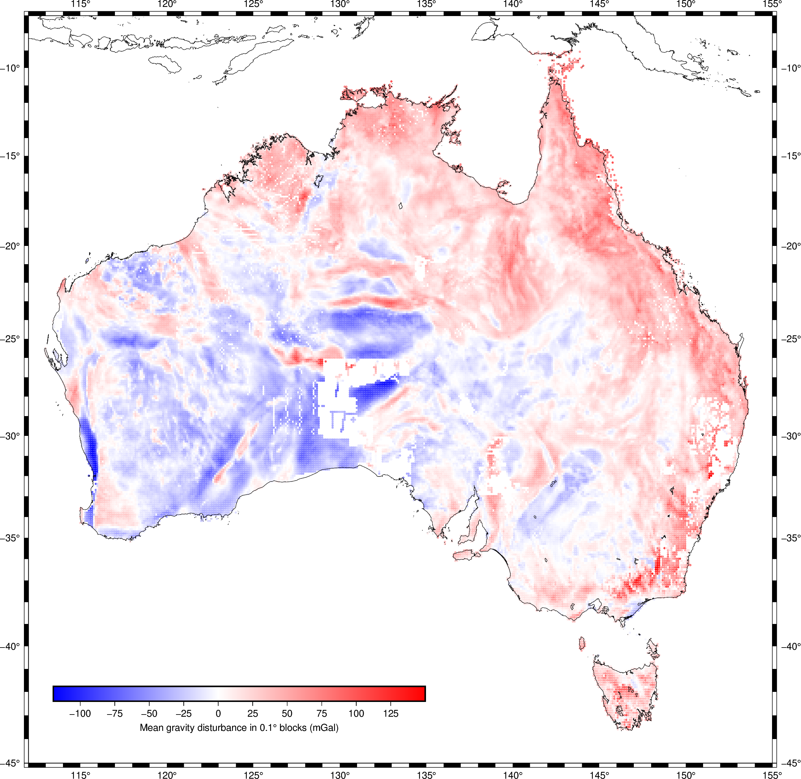

# Gravity data compilation for Australia

Playing around with downloading, cleaning, and combining all available
Geoscience Australia gravity data.

> Based on the compilation by [Wynne (2018)](https://doi.org/10.26186/5c1987fa17078),
> which is distributed under a CC-BY 4.0 license (see the source).


*Figure: Preview of the compiled gravity observations, downsampled 
with a blocked mean. Gravity disturbances were calculated from the 
compiled dataset.*

**NOTE:** After I did all of this, I discovered
[GeoscienceAustralia/geophys_utils](https://github.com/GeoscienceAustralia/geophys_utils)
which would have allowed me to download the individual surveys using a web API from Python.
This would have saved the work of finding, downloding, and combining the metadata files.

## Download the data compilation

The data compilation is available for download as a single netCDF file
from GitHub: https://github.com/compgeolab/australia-gravity-data/releases/latest

You can download and cache the data directly from your Python code using
[Pooch](https://www.fatiando.org/pooch/latest/):

```python
import xarray as xr
import pooch

fname = pooch.retrieve(
    url="https://github.com/compgeolab/australia-gravity-data/releases/download/v1.0/australia-ground-gravity.nc",
    known_hash="sha256:50f2fa53c5dc2c66dd3358b8e50024d21074fcc77c96191c549a10a37075bc7e",
    downloader=pooch.HTTPDownloader(progressbar=True)
)

# Load the data with xarray
data = xr.load_dataset(fname)
```

Paste the code above in your Jupyter notebooks or scripts to let Pooch 
automatically download the file (printing a progress bar), store it in a cache
folder, check the download integrity, and return to you the path to the cached
file. The download only happens the first time this code is run. Afterwards,
Pooch finds the data in the cache and only returns the link (so you can use
this code everywhere you need this file).

## Metadata and download links

The metadata records (including the download link) for all of the 
original surveys were downloaded manually in batches of 100 
(:disappointed:). 
These records are available in the `metadata` folder.

## Notebooks

* [`notebooks/catalogue.ipynb`](https://nbviewer.jupyter.org/github/compgeolab/australia-gravity-data/blob/main/notebooks/catalogue.ipynb):
  combines all these records into a single file
  (`metadata/records.csv`) and includes the proper download URL and file size
  (as returned by the server).
* [`notebooks/download.ipynb`](https://nbviewer.jupyter.org/github/compgeolab/australia-gravity-data/blob/main/notebooks/download.ipynb):
  uses [Pooch](https://www.fatiando.org/pooch/latest/)
  to download all survey netCDF files to a `data` folder. The 1631 surveys total
  less than 400 MB so it's not a large amount of data. The individual surveys
  will not be included in the repository to avoid making it too big.
* [`notebooks/merge.ipynb`](https://nbviewer.jupyter.org/github/compgeolab/australia-gravity-data/blob/main/notebooks/merge.ipynb):
  loads all surveys, selects the more relevant data, filter out unreliable surveys,
  merge them into a single dataset, and standardize the metadata (following CF
  conventions). Saves the data compilation to netCDF in `australia-gravity-data.nc`.
* [`notebooks/explore.ipynb`](https://nbviewer.jupyter.org/github/compgeolab/australia-gravity-data/blob/main/notebooks/explore.ipynb):
  explore the compiled gravity data using plots and maps.

## License

All source code is made available under a MIT license.
You can freely use and modify the code, without warranty,
so long as you provide attribution to the original authors.
See [LICENSE](LICENSE) for the full license text.

The data compilation is distributed under a [CC-BY license](https://creativecommons.org/licenses/by/4.0/).
